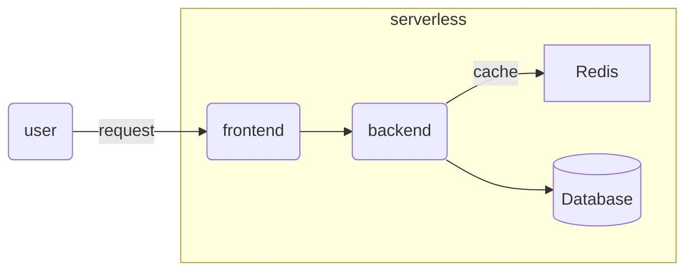

# ff-portfolio

### Architect Diagram

```mermaid
flowchart LR;
 user(user)-- request -->frontend(frontend);
 subgraph serverless
 frontend-->backend(backend);
 backend-- cache -->cache[Redis];
 backend-->db[(Database)];
 end
```

### Tech stack
- frontend
  + nextjs
  + cloudflare
- serverless
  + aws lambda function

- database
  + aws memcache
  + mongodb atlas
